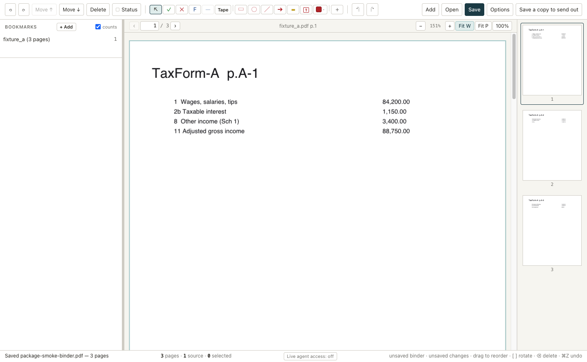

# LedgerPDF

**A local-first workpaper binder, built for tax and accounting professionals to
use alongside AI agents. A human and an agent can work in the same binder at the
same time.**

Drag in what you actually have. PDFs from your tax software, client documents,
Excel trial balances, scans, phone photos of receipts. LedgerPDF assembles
them into one ordered, bookmarked PDF binder. Place tick marks, drop calculator
tapes that show their addends, and link a figure to the page that supports it.



## What it does

- **One binder, one file.** The binder PDF *is* the document. Saving overwrites
  it, and an editable session rides inside the file itself — there is no sidecar
  project file to lose.
- **Marks that survive.** Tick marks, stamps, calculator tapes, shapes and notes
  export as standard PDF annotations, and render in Acrobat, Edge, Chrome and
  macOS Preview. Every mark's position is pixel-verified against two independent
  render engines.
- **Bookmarks that follow their pages.** Reorder anything; the outline moves with
  it. Drag a bookmark and its whole section of pages moves.
- **Real inputs.** PDFs, `.xlsx`/`.xlsm`/`.csv`, `.md`/`.docx`, and images. A
  spreadsheet becomes pages whose cells are real text, so a figure off a trial
  balance can be read exactly — not OCR'd, not guessed.
- **Whole-cent arithmetic.** Calculator tapes never touch floating point, and
  anything ambiguous is refused rather than assumed. A figure guessed wrong
  agrees confidently, which is worse than no figure at all.
- **Agents work in the same binder.** Not a chat box bolted onto a GUI — an MCP
  server exposing the same model the UI drives, so an agent reads pages, finds a
  figure by name, and marks the binder you have open. Everything it does is
  attributed to the AI, journalled, and revertible.

## Where your data goes

**The application makes no network calls.** No telemetry, no accounts, no cloud,
no auto-update phoning home. Your binders and the documents behind them stay on
your machine, in the engagement folder you chose. Live agent access is a **local**
unix socket or named pipe, never a TCP port, off by default, and requires a fresh
256-bit token each launch. POSIX also applies owner-only socket permissions;
Windows keeps the token file beneath the user's profile ACL.

**The one thing that can leave the machine is an AI agent you connect**, and the
distinction matters professionally: even then LedgerPDF is not what reaches the
network. Your MCP client is a separate program under your control, and the page
content it reads goes wherever that program sends it. With a hosted model that is
a disclosure of client information; with a locally-run model nothing leaves at
all. Either way it is your decision, and LedgerPDF does not make it for you.
Standalone agent filesystem access is disabled unless you explicitly approve
engagement folders in the app under Agent access. That approval permits reading
documents and creating or updating LedgerPDF files inside those folders, and it
persists when live access to the open binder is off. Operations outside the
approved folders are refused.

### What it does not do

Stated as plainly as the list above, because the absences matter more than the
features when you are deciding whether to put client data in something:

- Encrypt your files, enforce a retention schedule, or guarantee secure erasure.
- Provide central access control, reviewer sign-off, an immutable audit log, or
  any central administration. It does prevent two local LedgerPDF/agent
  processes from writing the same binder at once; that is a file-integrity lock,
  not a firm-wide permissions system.
- Decide what an agent may read or write. Standalone file access stays off until
  you approve folders yourself, and operations outside them are refused.
- Control what your AI client does with what it reads. That program is separate
  and under your control rather than ours.
- Make any determination about §7216, your WISP, Circular 230, or anything else
  you answer to. It cannot, and does not try.

### Considerations, not assurances

Nothing below is a compliance claim or a legal opinion. These are questions a tax
or accounting professional will want to work through, each set beside the plain
facts about how the application behaves. The questions are yours to settle. The
facts are ours to state and be held to.

- **IRC §7216 / §6713.** *To consider:* whether anything you do here involves a
  disclosure or use of return information, and if so what consent that calls for
  and in what form (Treas. Reg. §301.7216-3). *The facts:* the application makes
  no network calls; agent file access is off until you name folders in
  Agent access; once you do, a standalone agent can read documents and create or
  update LedgerPDF files there. Page text can include the SSN on a 1040.
- **FTC Safeguards Rule (16 CFR Part 314) and the WISP it requires.**
  *To consider:* how a local tool fits the written information security program
  you maintain, and which controls it supplies against which it leaves to you.
  *The facts:* binders, working copies and recovery files sit in the engagement
  folder you chose rather than a temp directory or a vendor's storage, owner-only
  on POSIX and inheriting folder permissions on Windows. The app does not encrypt
  files itself, enforce retention, or provide access control or administration.
  IRS Pubs 4557 and 5708 are useful starting points.
- **Circular 230 (31 CFR Part 10).** *To consider:* how you supervise
  machine-produced work, and how a reviewer tells it from your own. *The facts:*
  agent actions are attributed to the AI, journalled in order and revertible in
  one step; agent marks are outlined on the page. The tool reaches no conclusions
  and signs nothing.
- **AICPA Code of Professional Conduct.** *To consider:* whether connecting an
  agent brings a model provider into the engagement as a third party for
  confidentiality purposes, and what consent or agreement you would want first.
  *The facts:* with no agent connected there is no vendor account, telemetry
  endpoint or support tunnel in the software. Connect one and what it reads goes
  wherever that program sends it.

This list is not complete and is not meant to be. State board rules and
breach-notification statutes vary, and your firm's analysis governs. The source
is published under GPL-3.0 so you or your IT reviewer can verify the factual half
against the code rather than take it on trust;
[`DATA-FLOW.md`](DATA-FLOW.md) sets out where every file goes.

## Status

**Alpha.** Used daily by its author on real engagements. Expect rough edges, and
do not make it the only copy of anything.

The **macOS** release is Apple silicon only, and is signed with a Ledger Labs LLC
Developer ID certificate, notarized by Apple, and stapled — so it opens with no
warning and no right-click dance, offline included. Unsigned or ad-hoc local
packages are never release artifacts.

**Windows releases are not code-signed yet, and ship anyway.** Azure Trusted
Signing requires three years of verifiable business history and Ledger Labs LLC
was formed in June 2025, so that route is closed until 2028; an interim
certificate is in progress. Signing is a fast-follow, not a release gate,
because the functional blocker was mark-of-the-web and the installer already
solves that — what remains is one publisher warning, described below.

### Getting a build

Download the current installers and checksums from the
**[LedgerPDF v0.1.1 release](https://github.com/charliebarmore/ledgerpdf/releases/tag/v0.1.1)**.

On **macOS**, download the `.dmg` or the `.zip`, open it, and drag LedgerPDF to
Applications. It is notarized and stapled, so it launches with no warning.
Apple silicon only — the frozen Python engine is arm64.

On **Windows**, run the installer. Because it is not signed yet, SmartScreen
**may** show an "unrecognised publisher" warning once: click **More info →
Run anyway**. That prompt is about *identity verification* — nobody has paid a
certificate authority to vouch for the publisher's name — and not about anything
the software does. Signing will remove it; until then
[`docs/INSTALL-WINDOWS.md`](docs/INSTALL-WINDOWS.md) walks the install and says
plainly what the prompt means rather than telling anyone to click through it. On
a first real test (2026-08-07, Windows 11, Defender on, mark-of-the-web applied)
it did not appear at all; a stricter machine may still show it.

Uninstalling removes the application and shortcuts but retains preferences and
the recent-binder list in `%APPDATA%\LedgerPDF`; see
[`docs/INSTALL-WINDOWS.md`](docs/INSTALL-WINDOWS.md#uninstalling) for what that
folder contains and how to remove it without touching binder PDFs.

Two other ways to run it, in order of effort:

1. **A test CI build**, if you have access to this repository. Go to the **Windows
   x64** workflow under the Actions tab and **"Run workflow"** with `package`
   ticked — the installer is attached only on a manual dispatch, deliberately,
   because uploading a ~140 MB installer on every push burns the storage quota.
   Ordinary pushes still build, package and verify; they just attach evidence
   rather than a download. Artifacts expire after 3 days and are **unsigned:
   for pilot testing, not for redistribution.**
2. **From source**, below. Works on macOS and Windows and takes about five
   minutes on a machine that already has Node and Python.

## Build from source

Requires Node 22.12+ and Python 3.12+. Expect roughly 1.3 GB on
disk once `node_modules`, the venv and a packaged build are all present.

**macOS / Linux**

```bash
git clone https://github.com/charliebarmore/ledgerpdf.git
cd ledgerpdf

python3 -m venv engine/.venv
engine/.venv/bin/pip install --require-hashes -r engine/requirements.lock
engine/.venv/bin/pip install --require-hashes -r engine/requirements-build.lock # packaging only

engine/.venv/bin/python spike/run_spike.py                      # build fixtures
```

**Windows (PowerShell)**

A virtual environment puts its interpreter in `Scripts\` on Windows rather than
`bin/`, and there is no `python3` on the PATH — `python3` there is a Microsoft
Store stub that will not create a venv.

```powershell
git clone https://github.com/charliebarmore/ledgerpdf.git
cd ledgerpdf

python -m venv engine\.venv
engine\.venv\Scripts\pip install --require-hashes -r engine\requirements.lock
engine\.venv\Scripts\pip install --require-hashes -r engine\requirements-build.lock # packaging only

engine\.venv\Scripts\python spike\run_spike.py                      # build fixtures
```

**Then, on either platform**

```bash
cd app
npm ci
npm run dev            # run it
npm run verify         # the full check suite
npm run package:dir    # a packaged app in app/release/
```

Two notes on the steps above, both of which otherwise fail on a clean clone:

- **Fixtures are gitignored** — they are synthetic and never committed — so
  `spike/run_spike.py` has to run once before `npm run verify` has anything to
  check. CI regenerates them the same way.
- **`requirements-build.lock` is separate** and holds PyInstaller, which freezes
  the Python engine into the packaged app. Skip it and `npm run dev` still
  works; `npm run package:dir` fails with `No module named PyInstaller`.

`npm run dev` takes roughly fifteen seconds to show a window the first time —
Vite builds the main and renderer bundles before Electron launches. It is not
hung.

## How it is built

An Electron + React front end over a **Python engine** (`pikepdf`/`qpdf`) that
does every PDF operation, spoken to as a JSON-over-stdio subprocess. The engine
is the same one the MCP server drives, so an agent and a person cannot produce
different artefacts. Annotation appearance streams are hand-authored, and page
geometry is resolved through one definition so a word's coordinates and a tick's
coordinates cannot mean different things.

## Licence

Copyright © 2026 **Ledger Labs LLC**. Released under the **GNU General Public
Licence v3.0 or later** — see [`LICENSE`](LICENSE), with the reasoning and a
dependency-compatibility audit in [`COPYRIGHT.md`](COPYRIGHT.md).

Copyleft is deliberate. The claim above — that nothing leaves your machine — is
only worth what your own IT reviewer can check, and this way they can check it.

## Contributing

Feedback and bug reports are the most useful thing you can send. See
[`CONTRIBUTING.md`](CONTRIBUTING.md) — and please read the note there about not
attaching real client documents.

---

Built by [Charlie Barmore](https://cbarmorecpa.com), CPA/CFE, because assembling
a binder is hours of work a competent agent could do, and no workpaper tool was
built for one to drive.
